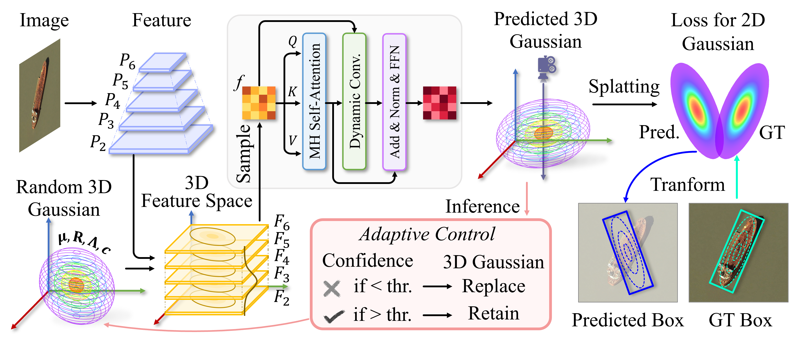

# GSDet (IJCAI 2025)


> [GSDet: Gaussian Splatting for Oriented Object Detection]()

The baseline of GSDet is avaliable at [ai4rs](https://github.com/wokaikaixinxin/ai4rs/blob/main/projects/GSDet_baseline/README_GSDet_baseline.md)  
The baseline of GSDet is avaliable at [ai4rs](https://github.com/wokaikaixinxin/ai4rs/blob/main/projects/GSDet_baseline/README_GSDet_baseline.md)   
The baseline of GSDet is avaliable at [ai4rs](https://github.com/wokaikaixinxin/ai4rs/blob/main/projects/GSDet_baseline/README_GSDet_baseline.md)  
The baseline of GSDet is avaliable at [ai4rs](https://github.com/wokaikaixinxin/ai4rs/blob/main/projects/GSDet_baseline/README_GSDet_baseline.md)   

## Abstract

<div align=center>

</div>

Oriented object detection has advanced with the development of convolutional neural networks (CNNs) and transformers. However, modern detectors still rely on predefined object candidates, such as anchors in CNN-based methods or queries in transformer-based methods, which struggle to capture spatial information effectively. To address the limitations, we propose GSDet, a novel framework that formulates oriented object detection as Gaussian splatting. Specifically, our approach performs detection within a 3D feature space constructed from image features, where 3D Gaussians are employed to represent oriented objects. These 3D Gaussians are projected onto the image plane to form 2D Gaussians, which are then transformed into oriented boxes. Furthermore, we optimize the mean, anisotropic covariance, and confidence scores of these randomly initialized 3D Gaussians, using a decoder that incorporates 3D Gaussian sampling. Moreover, our method exhibits flexibility, enabling adaptive control and a dynamic number of Gaussians during inference. Experiments on 3 datasets indicate that GSDet achieves AP50 gains of 0.7% on DIOR-R, 0.3% on DOTA-v1.0, and 0.55% on DOTA-v1.5 when evaluated with adaptive control and outperforms mainstream detectors.


## Insight

<!-- - 模型能将随机输入学习得到目标。随机输入都可行，其他类型的输入大概率也是可行的。 -->
<!-- - 旋转框可以表征为概率分布，如高斯分布。万物都可以表征为不同的概率分布。 -->
<!-- - 扩散模型、高斯泼溅等都涉及概率分布，都涉及随机性。 -->
<!-- - 架构是decoder-only型，由多层decoder layer堆叠。代码借用了openmmlab 中two-stage类作为父类，事实上，将one-stage或transformer作为父类都可以。 -->

- The model can learn targets from random inputs. If random inputs work, other types of inputs are likely feasible as well.  
- Oriented boxes can be represented as probability distributions, such as Gaussian distributions. Everything can be characterized by different probability distributions.  
- Diffusion models, Gaussian splatting, etc., all involve probability distributions and randomness.  
- The architecture is decoder-only, stacked with multiple decoder layers. The code borrows the two-stage class from OpenMMLab as the parent class, though using one-stage or Transformer as the parent is also possible.


## Citation

```
@inproceedings{ijcai2025p101,
  title     = {GSDet: Gaussian Splatting for Oriented Object Detection},
  author    = {Ding, Zeyu and Zhao, Jiaqi and Zhou, Yong and Du, Wen-liang and Zhu, Hancheng and Yao, Rui},
  booktitle = {Proceedings of the Thirty-Fourth International Joint Conference on
               Artificial Intelligence, {IJCAI-25}},
  publisher = {International Joint Conferences on Artificial Intelligence Organization},
  editor    = {James Kwok},
  pages     = {900--908},
  year      = {2025},
  month     = {8},
  note      = {Main Track},
  doi       = {10.24963/ijcai.2025/101},
  url       = {https://doi.org/10.24963/ijcai.2025/101},
}
```
